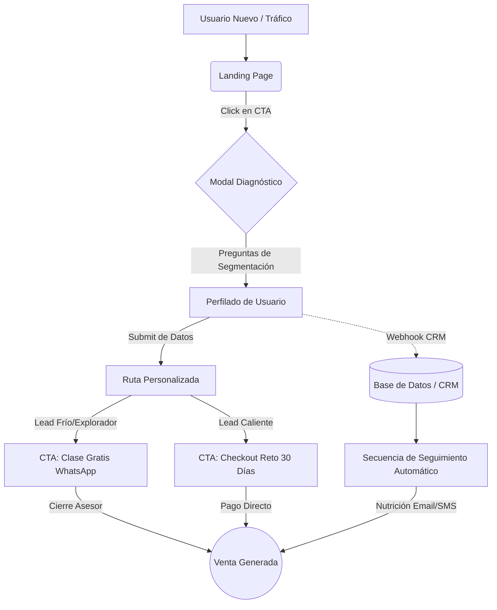

# Tutorial de Uso y Flujo (Sistema de Adquisición EmprendeOS)

Este documento detalla el comportamiento del sistema como una máquina de adquisición y conversión. Está diseñado para que cualquier desarrollador, marketer o miembro del equipo entienda exactamente cómo fluye el usuario, cómo se procesan los datos y cómo el sistema genera ventas.

## 1. FLUJO DEL USUARIO FINAL

El recorrido psicológico y técnico que experimenta el prospecto:

1. **Aterrizaje (Landing)**: El usuario llega a la página. Es impactado por una promesa a 30 días, dolor claro y urgencia real.
2. **Diagnóstico**: Hace clic en "Descubre qué tipo de emprendedor eres".
3. **Segmentación**: Responde 3 preguntas estratégicas sobre su etapa, su bloqueo y su objetivo a 30 días.
4. **Captura (Registro)**: Deja su Nombre, Email y WhatsApp a cambio de su ruta.
5. **Ruta Personalizada**: Inmediatamente ve una recomendación dinámica (ej. si no tiene producto, la ruta es Descubrir + Validar).
6. **CTA Dirigido (WhatsApp / Reto)**: Según su nivel de consciencia, se le envía a WhatsApp para cualificación (Clase Gratis) o directo al Checkout del Reto.
7. **CRM & Seguimiento**: Una vez que dejó sus datos en el paso 4, ya forma parte del CRM. El seguimiento automatizado se dispara (ver `email_sequence.md`).

## 2. FLUJO DEL SISTEMA (BACKEND LÓGICO)

- **Captura de Eventos**: Cada interacción de interés (click, scroll, sumisión) llama a la función `trackEvent(eventName, data)`.
- **Modos de Entorno (`ENV_MODE`)**: 
  - Si `ENV_MODE = "preview"`, `trackEvent` solo pinta los eventos en `console.log` para validación y testing QA.
  - Si `ENV_MODE = "production"`, `trackEvent` inyecta los datos en `window.dataLayer`.
- **Diagnóstico y Routing**: El componente `<DiagnosticModal />` guarda las respuestas en su estado interno de React (`answers`). Al hacer submit, consolida la data con el `formData` (datos del lead) y dispara el evento `submit_diagnostic`. 
- **Guardado del Lead**: La función `handleFormSubmit` del Modal es el punto de inyección hacia el backend. Aquí se hará un `fetch` hacia el Webhook (Zapier/Make/CRM API) para almacenar el lead.
- **WhatsApp Flow**: Al hacer clic en el botón de WhatsApp, la app construye dinámicamente un enlace `wa.me` inyectando un mensaje codificado para que el cerrador comercial sepa de qué viene.

## 3. FLUJO DE CONVERSIÓN

- **Entrada (0s)**: Se carga el UI oscuro, contrastante y el dashboard SaaS, elevando la autoridad (no parece un curso).
- **Scroll Profundo**: Mientras el usuario baja leyendo el copywriting agresivo, el hook `useScrollTracking` registra (25%, 50%, 75%, 100%) para calificar su nivel de interés.
- **Interacción Diagnóstico**: La curiosidad obliga al usuario a abrir el modal. Esta micro-conversión reduce la fricción porque las preguntas son sobre *él*.
- **Submit Formulario**: Primer micro-compromiso fuerte (deja datos). Pasa de "Tráfico Anónimo" a "Lead Cualificado".
- **CTA Final (WhatsApp o Checkout)**: Ya perfilado y nutrido con la recomendación, el usuario entra a la fase final de conversión monetaria.

## 4. MAPA VISUAL SIMPLE

## 5. EXPLICACIÓN DEL TRACKING

El sistema está cableado con analítica granular para medir la retención y conversión.

**Eventos Actuales:**
- `click_cta_hero`, `click_cta_offer`, `click_cta_final`: Mide qué parte de la página genera más intención.
- `click_free_class`, `whatsapp_click`: Para trackear inicio de conversaciones.
- `click_diagnostic`, `submit_diagnostic`: Para medir la tasa de drop-off dentro del embudo del modal (cuántos abren vs cuántos dejan datos).
- `scroll_25` hasta `scroll_100`: Para ver hasta dónde lee el usuario.

**Conexión Futura (En Producción):**
Al enviar todo al `window.dataLayer`, Google Tag Manager capturará los eventos. GTM se encarga de:
- Avisarle al **Pixel de Meta (Facebook Ads)** que hubo un Lead para optimizar campañas.
- Avisarle a **Google Analytics 4** para los reportes de retención.
- Enviar señales al **CRM** para iniciar el *Lead Scoring* (ej. un usuario que llegó al scroll 100% vale más que uno que se fue en el 25%).
